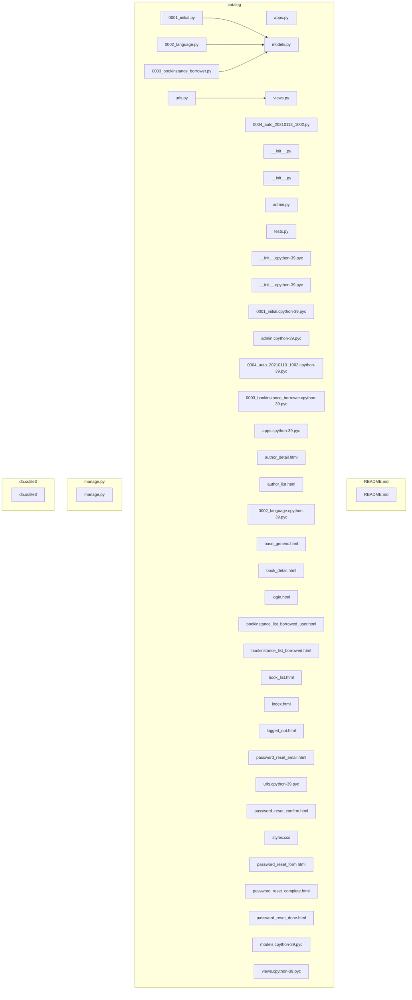
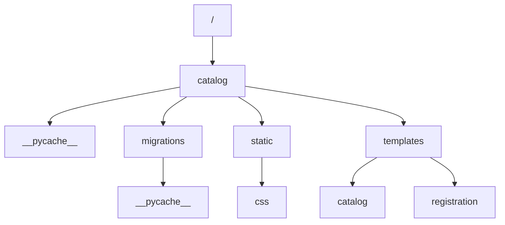

# Locallibrary

## Project Description

The **Locallibrary** project is a web application designed to facilitate user account management and authentication within a library system. Built on the robust **Django framework**, it provides essential functionalities such as user registration, login, password management, and session handling. The application aims to streamline the authentication process for users, ensuring secure access to library resources while enhancing user experience through intuitive interfaces and clear feedback mechanisms.

Key features of Locallibrary include a comprehensive user authentication system that leverages Django's built-in security measures, ensuring data integrity and user privacy. The application supports critical workflows such as user login, password reset requests, and session management, all vital for a seamless user experience. Additionally, the project employs a series of well-structured HTML templates to provide users with informative feedback during authentication processes, such as confirmation of successful logouts and notifications upon initiating password resets. These features not only improve user engagement but also foster trust in the system by prioritizing security and clarity in user interactions.

Technologically, Locallibrary implements the **Model-View-Template (MVT)** architecture, promoting a clean separation of concerns and enhancing maintainability. It utilizes Django's **Object-Relational Mapping (ORM)** for effective data handling, allowing developers to interact with a database of user information without needing to write raw SQL queries. The project also adheres to design patterns such as template inheritance and the Command Pattern, facilitating extensibility and modularity within the application’s structure.

Locallibrary is particularly valuable for developers and organizations looking to implement a secure authentication system within a web application. It targets stakeholders involved in library management or any system requiring user account management. By providing a user-friendly interface and robust security features, Locallibrary serves as an excellent foundation for developers seeking to enhance user experience while ensuring the integrity and security of user data.

## Table of Contents

- [Features](#features)
- [Project Structure](#project-structure)
- [Architecture](#architecture)
- [Installation](#installation)
- [Configuration](#configuration)
- [Usage](#usage)
- [API Documentation](#api-documentation)
- [Technologies](#technologies)
- [Contributing](#contributing)
- [License](#license)

## Features

- **Streamline Database Management**: Effortlessly manage your data with Django's ORM, allowing for intuitive interactions with your database through Python objects.

- **Simplify Migrations**: Easily apply and manage database schema changes with built-in migration files, ensuring your database is always up to date with your application’s needs.

- **Enhance User Interaction**: Utilize ready-to-use UI components that improve user experience, making it simple for users to navigate and interact with your application.

- **Facilitate Language Management**: Support multilingual applications with dedicated language migration files, enabling you to reach a broader audience and enhance accessibility.

- **Organize URL Routing**: Maintain clean and efficient URL routing with customizable paths defined in `urls.py`, ensuring users can easily access different parts of your application.

- **Integrate Custom Applications**: Leverage the modular architecture of Django apps to seamlessly integrate and scale functionalities tailored to your project’s specific requirements.

## Architecture

### Dependency Graph

Visualization of the relationships between the project files:



### Directory Structure

Hierarchical organization of folders in the project:



## Project Structure

```
├─ README.md
├─ catalog/
│  ├─ __pycache__/
│  │  ├─ __init__.cpython-39.pyc
│  │  ├─ admin.cpython-39.pyc
│  │  ├─ apps.cpython-39.pyc
│  │  ├─ models.cpython-39.pyc
│  │  ├─ urls.cpython-39.pyc
│  │  └─ views.cpython-39.pyc
│  ├─ migrations/
│  │  ├─ __pycache__/
│  │  │  ├─ __init__.cpython-39.pyc
│  │  │  ├─ 0001_initial.cpython-39.pyc
│  │  │  ├─ 0002_language.cpython-39.pyc
│  │  │  ├─ 0003_bookinstance_borrower.cpython-39.pyc
│  │  │  └─ 0004_auto_20210113_1002.cpython-39.pyc
│  │  ├─ __init__.py
│  │  ├─ 0001_initial.py
│  │  ├─ 0002_language.py
│  │  ├─ 0003_bookinstance_borrower.py
│  │  └─ 0004_auto_20210113_1002.py
│  ├─ static/
│  │  └─ css/
│  │     └─ styles.css
│  ├─ templates/
│  │  ├─ catalog/
│  │  │  ├─ author_detail.html
│  │  │  ├─ author_list.html
│  │  │  ├─ book_detail.html
│  │  │  ├─ book_list.html
│  │  │  ├─ bookinstance_list_borrowed_user.html
│  │  │  └─ bookinstance_list_borrowed.html
│  │  ├─ registration/
│  │  │  ├─ logged_out.html
│  │  │  ├─ login.html
│  │  │  ├─ password_reset_complete.html
│  │  │  ├─ password_reset_confirm.html
│  │  │  ├─ password_reset_done.html
│  │  │  ├─ password_reset_email.html
│  │  │  └─ password_reset_form.html
│  │  ├─ base_generic.html
│  │  └─ index.html
│  ├─ __init__.py
│  ├─ admin.py
│  ├─ apps.py
│  ├─ models.py
│  ├─ tests.py
│  ├─ urls.py
│  └─ views.py
├─ db.sqlite3
└─ manage.py
```

### Key Directories

- **catalog/**: Contains the Django application files, UI components, and database interactions.

### Key Files

- **0001_initial.py**: Migration file for the initial database schema.
- **0002_language.py**: Migration file for language support.
- **0003_bookinstance_borrower.py**: Migration file for book instance borrow relationships.
- **urls.py**: URL routing configuration for the application.
- **apps.py**: Application configuration for Django.
- **0004_auto_20210113_1002.py**: Auto-generated migration file.
- **__init__.py**: Marks the directory as a Python package.

## Installation

```bash
# Clone the repository
git clone https://github.com/Galerix/locallibrary.git

# Navigate to the project directory
cd locallibrary

# Install dependencies
npm install
```

## Configuration

Create a `.env` file in the root directory with variables similar to these. Here's a `.env.example` file tailored for a Django project that involves a UI component, database interactions, migrations, and ORM usage. Each environment variable includes a descriptive comment and a sample placeholder value.

```env
# Django secret key for cryptographic signing
DJANGO_SECRET_KEY='your-secret-key-here'

# Debug mode, set to False in production
DEBUG='True'

# Database configuration
# Database engine (e.g., 'django.db.backends.postgresql', 'django.db.backends.sqlite3', etc.)
DATABASE_ENGINE='django.db.backends.postgresql'

# Database name
DATABASE_NAME='your_database_name_here'

# Database user
DATABASE_USER='your_database_user_here'

# Database password
DATABASE_PASSWORD='your_database_password_here'

# Database host (e.g., 'localhost', '127.0.0.1', or an IP address)
DATABASE_HOST='localhost'

# Database port (default PostgreSQL port is 5432)
DATABASE_PORT='5432'

# Allowed hosts for the application
ALLOWED_HOSTS='localhost, 127.0.0.1'

# Email configuration for sending emails
# Email backend to be used (e.g., 'django.core.mail.backends.smtp.EmailBackend')
EMAIL_BACKEND='django.core.mail.backends.smtp.EmailBackend'

# Email host (e.g., 'smtp.gmail.com')
EMAIL_HOST='smtp.example.com'

# Email host user (your email address)
EMAIL_HOST_USER='your_email@example.com'

# Email host password
EMAIL_HOST_PASSWORD='your_email_password_here'

# Email port (default SMTP port is 587)
EMAIL_PORT='587'

# Use TLS for the email connection
EMAIL_USE_TLS='True'

# API keys for any third-party services (if applicable)
# Example for a hypothetical payment gateway API key
PAYMENT_GATEWAY_API_KEY='your_payment_gateway_api_key_here'

# Any other third-party API keys or configurations can be added here
# Example for a cloud storage service
CLOUD_STORAGE_API_KEY='your_cloud_storage_api_key_here'

# Define static and media files settings
# URL prefix for static files
STATIC_URL='/static/'

# URL prefix for media files
MEDIA_URL='/media/'

# Path to the directory where static files are collected
STATIC_ROOT='/path/to/static/'

# Path to the directory where media files are stored
MEDIA_ROOT='/path/to/media/'

# Optional: Set the timezone for the application
TIME_ZONE='UTC'
```

## Usage

Start the development server:

```bash
npm run dev
```

For production use:

```bash
npm start
```

## API Documentation

API documentation is not available.

## Technologies

- **Django**: A high-level Python web framework.
- **Python**: The programming language used to build the application.
- **PostgreSQL**: The relational database management system used.

## Contributing

Contributions are welcome! Please feel free to submit a Pull Request.

1. Fork the repository
2. Create a feature branch: `git checkout -b feature/new-feature`
3. Commit your changes: `git commit -am 'Add new feature'`
4. Push to the branch: `git push origin feature/new-feature`
5. Submit a pull request

## License

This project is licensed under the MIT License.

## Quick Start Guide

### Prerequisites

- Python 3.x installed on your machine.
- Django (version compatible with the project).
- A relational database (e.g., PostgreSQL, MySQL).
- Basic knowledge of Django and ORM concepts.

### Getting Started

1. **Clone the Repository**
   - Use `git clone <repository-url>` to clone the project to your local machine.

2. **Install Dependencies**
   - Navigate to the project directory and run `pip install -r requirements.txt` to install the necessary Python packages.

3. **Database Setup**
   - Create a new database using your preferred database management system.
   - Update the database configuration in the `settings.py` file.

4. **Run Migrations**
   - Execute `python manage.py migrate` to set up the database schema.

5. **Start the Development Server**
   - Run `python manage.py runserver` to start the development server.
   - Access the application at `http://127.0.0.1:8000`.

### Basic Usage Example

- Navigate to the application in your web browser.
- Use the provided UI components to interact with the application. For detailed functionality, refer to the specific features implemented in the project.

### Next Steps

- For more information on advanced usage and features, check the [Documentation](link-to-documentation) or the project's Wiki.
- Join the community on [Discord/Slack](link-to-community) for support and discussions.