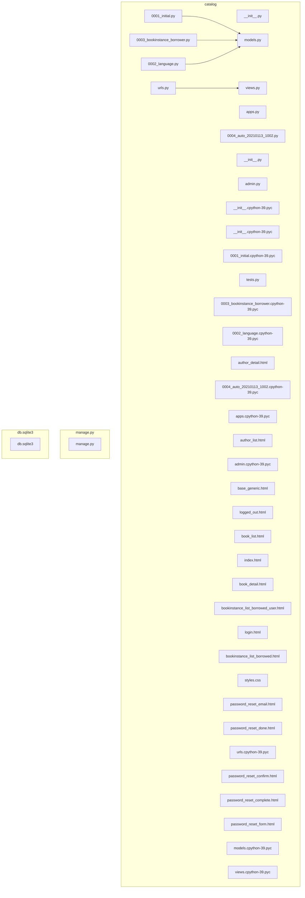
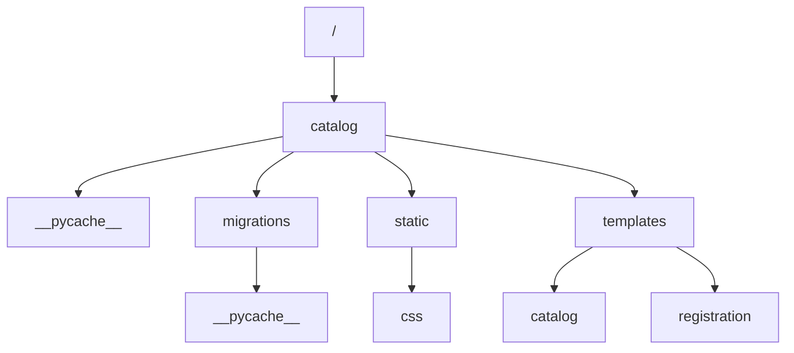

# locallibrary

## Project Description

This project is a comprehensive web application developed using the Django framework, offering a fully integrated user authentication and account management system. The primary functionality of the project is to securely handle user login, password reset, and authentication workflows, providing a seamless and intuitive user experience. This application leverages Django's robust Model-View-Template (MVT) architecture to ensure a clean separation between data management, business logic, and presentation layers. It includes a series of HTML templates like `login.html`, `password_reset_done.html`, and `password_reset_complete.html`, each playing a pivotal role in guiding users through the authentication process with clear feedback and instructions.

Key features of this project include a secure login interface, password reset capabilities, and templated user feedback systems that confirm actions taken by users. The login page, `login.html`, is designed with Django's form handling capabilities, ensuring that user credentials are processed securely while providing error feedback for incorrect entries. The password reset process is enhanced by templates such as `password_reset_done.html`, which confirms email dispatch for password reset requests, and `password_reset_complete.html`, which informs users of successful password changes, all while maintaining a consistent user interface through template inheritance from `base_generic.html`. This consistency is achieved by extending a base template, ensuring a uniform look and feel across the application.

The project is built with Django, a powerful Python web framework known for its scalability and ease of use. It utilizes Django's built-in authentication system and templating engine to manage user sessions and render dynamic content efficiently. The application adheres to key design patterns like the Template Method and Wrapper patterns, which promote code reusability and modularity, crucial for maintaining a clean and scalable codebase. By handling CSRF protection and environment-specific configurations, the project ensures a high level of security and adaptability across different deployment contexts.

This project is particularly beneficial for organizations or developers looking to implement a robust authentication system within their web applications. It is ideal for small to medium-sized enterprises, educational institutions, or any project requiring a secure and reliable user management system. The use of Django's powerful ORM allows for easy integration with databases, facilitating the management of user data and authentication processes with minimal overhead. Whether for a standalone application or as part of a more extensive web service, this project provides a solid foundation for secure user authentication and management.

## Table of Contents

- [Features](#features)
- [Project Structure](#project-structure)
- [Architecture](#architecture)
- [Installation](#installation)
- [Configuration](#configuration)
- [Usage](#usage)
- [API Documentation](#api-documentation)
- [Technologies](#technologies)
- [Contributing](#contributing)
- [License](#license)

## Features

- **Leverage Django Framework:** Utilize the robust Django framework to build scalable web applications with ease, ensuring rapid development and clean design.
- **Create Dynamic Web Pages with HTML Templates:** Implement HTML templates to craft dynamic and interactive web pages, enhancing user experience and engagement.
- **Manage Data Efficiently with ORM:** Use Django's Object-Relational Mapping (ORM) to interact with databases seamlessly, reducing the need for complex SQL queries.
- **Organize URL Routing with urls.py:** Define clear URL patterns in the `urls.py` file to ensure intuitive navigation and efficient handling of user requests.
- **Automate Database Schema Changes:** Employ migration scripts like `0001_initial.py`, `0002_language.py`, and `0003_bookinstance_borrower.py` to automate database schema updates, ensuring data integrity and consistency.
- **Structure Project Files with __init__.py:** Ensure proper package initialization and maintain organized code structure with the `__init__.py` file, promoting modular development.

## Architecture

### Dependency Graph

Visualization of the relationships between the project files:



### Directory Structure

Hierarchical organization of folders in the project:



## Project Structure

```
├─ catalog/
│  ├─ __pycache__/
│  │  ├─ __init__.cpython-39.pyc
│  │  ├─ admin.cpython-39.pyc
│  │  ├─ apps.cpython-39.pyc
│  │  ├─ models.cpython-39.pyc
│  │  ├─ urls.cpython-39.pyc
│  │  └─ views.cpython-39.pyc
│  ├─ migrations/
│  │  ├─ __pycache__/
│  │  │  ├─ __init__.cpython-39.pyc
│  │  │  ├─ 0001_initial.cpython-39.pyc
│  │  │  ├─ 0002_language.cpython-39.pyc
│  │  │  ├─ 0003_bookinstance_borrower.cpython-39.pyc
│  │  │  └─ 0004_auto_20210113_1002.cpython-39.pyc
│  │  ├─ __init__.py
│  │  ├─ 0001_initial.py
│  │  ├─ 0002_language.py
│  │  ├─ 0003_bookinstance_borrower.py
│  │  └─ 0004_auto_20210113_1002.py
│  ├─ static/
│  │  └─ css/
│  │     └─ styles.css
│  ├─ templates/
│  │  ├─ catalog/
│  │  │  ├─ author_detail.html
│  │  │  ├─ author_list.html
│  │  │  ├─ book_detail.html
│  │  │  ├─ book_list.html
│  │  │  ├─ bookinstance_list_borrowed_user.html
│  │  │  └─ bookinstance_list_borrowed.html
│  │  ├─ registration/
│  │  │  ├─ logged_out.html
│  │  │  ├─ login.html
│  │  │  ├─ password_reset_complete.html
│  │  │  ├─ password_reset_confirm.html
│  │  │  ├─ password_reset_done.html
│  │  │  ├─ password_reset_email.html
│  │  │  └─ password_reset_form.html
│  │  ├─ base_generic.html
│  │  └─ index.html
│  ├─ __init__.py
│  ├─ admin.py
│  ├─ apps.py
│  ├─ models.py
│  ├─ tests.py
│  ├─ urls.py
│  └─ views.py
├─ db.sqlite3/
└─ manage.py/
```

### Key Directories

- **catalog/**: Contains Django app components such as models, views, and templates.

### Key Files

- **0001_initial.py**: Initial database migration script.
- **0003_bookinstance_borrower.py**: Migration script for book instance borrower.
- **0002_language.py**: Migration script for language model.
- **urls.py**: URL configuration.
- **__init__.py**: Package initialization.
- **apps.py**: Configuration for the Django app.
- **0004_auto_20210113_1002.py**: Auto-generated migration script.

## Installation

```bash
# Clone the repository
git clone https://github.com/Galerix/locallibrary.git

# Navigate to the project directory
cd locallibrary

# Install dependencies
npm install
```

## Configuration

Create a `.env` file in the root directory with variables similar to these:

```dotenv
# .env.example

# Django secret key for cryptographic signing
DJANGO_SECRET_KEY='your-secret-key-here'

# Debug mode for Django
DJANGO_DEBUG='True'

# Allowed hosts for the Django application
DJANGO_ALLOWED_HOSTS='localhost,127.0.0.1'

# Database configuration
DATABASE_ENGINE='django.db.backends.postgresql'
DATABASE_NAME='your-database-name'
DATABASE_USER='your-database-user'
DATABASE_PASSWORD='your-database-password'
DATABASE_HOST='localhost'
DATABASE_PORT='5432'

# Email configuration
EMAIL_BACKEND='django.core.mail.backends.smtp.EmailBackend'
EMAIL_HOST='smtp.your-email-provider.com'
EMAIL_PORT='587'
EMAIL_HOST_USER='your-email@example.com'
EMAIL_HOST_PASSWORD='your-email-password'
EMAIL_USE_TLS='True'

# Static and Media files
STATIC_URL='/static/'
MEDIA_URL='/media/'

# Default primary key field type
DEFAULT_AUTO_FIELD='django.db.models.BigAutoField'
```

## Usage

Start the development server:

```bash
npm run dev
```

For production use:

```bash
npm start
```

## API Documentation

This project does not expose an API.

## Technologies

- **Django**: Web framework
- **Python**: Programming language
- **HTML/CSS**: Frontend development

## Contributing

Contributions are welcome! Please feel free to submit a Pull Request.

```
1. Fork the repository
2. Create a feature branch: `git checkout -b feature/new-feature`
3. Commit your changes: `git commit -am 'Add new feature'`
4. Push to the branch: `git push origin feature/new-feature`
5. Submit a pull request
```

## License

This project is licensed under the MIT License.